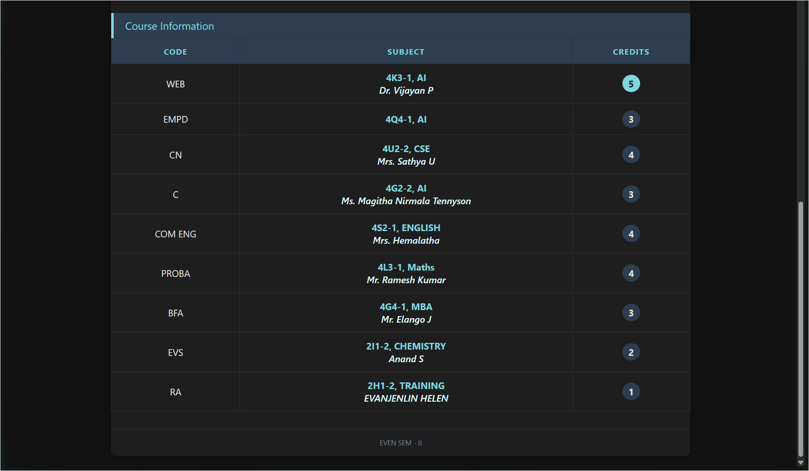
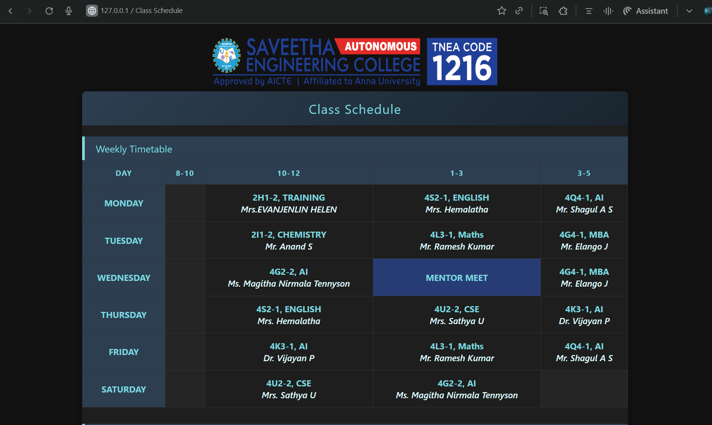

# Ex03 Time Table
## Date:16/11/2025

## AIM
To write a html webpage page to display your slot timetable.

## ALGORITHM
### STEP 1
Create a Django-admin Interface.

### STEP 2
Create a static folder and inert HTML code.

### STEP 3
Create a simple table using ```<table>``` tag in html.

### STEP 4
Add header row using ```<th>``` tag.

### STEP 5
Add your timetable using ```<td>``` tag.

### STEP 6
Execute the program using runserver command.

## PROGRAM
```html
<!DOCTYPE html>
<html lang="en">
<head>
    <meta charset="UTF-8">
    <title>Class Schedule</title>
</head>
<body>
    <center></center>

    <h1 align="center">Class Schedule</h1>

    <h2>Weekly Timetable</h2>
    <table border="1" width="100%" cellspacing="0" cellpadding="10">
        <tr>
            <th>DAY</th>
            <th>8-10</th>
            <th>10-12</th>
            <th>1-3</th>
            <th>3-5</th>
        </tr>
        <tr>
            <td>MONDAY</td>
            <td></td>
            <td>2H1-2, TRAINING<br>Mrs. EVANJENLIN HELEN</td>
            <td>4S2-1, ENGLISH<br>Mrs. Hemalatha</td>
            <td>4Q4-1, AI<br>Mr. Shagul A S</td>
        </tr>
        <tr>
            <td>TUESDAY</td>
            <td></td>
            <td>2I1-2, CHEMISTRY<br>Mr. Anand S</td>
            <td>4L3-1, Maths<br>Mr. Ramesh Kumar</td>
            <td>4G4-1, MBA<br>Mr. Elango J</td>
        </tr>
        <tr>
            <td>WEDNESDAY</td>
            <td></td>
            <td>4G2-2, AI<br>Ms. Magitha Nirmala Tennyson</td>
            <td>MENTOR MEET</td>
            <td>4G4-1, MBA<br>Mr. Elango J</td>
        </tr>
        <tr>
            <td>THURSDAY</td>
            <td></td>
            <td>4S2-1, ENGLISH<br>Mrs. Hemalatha</td>
            <td>4U2-2, CSE<br>Mrs. Sathya U</td>
            <td>4K3-1, AI<br>Dr. Vijayan P</td>
        </tr>
        <tr>
            <td>FRIDAY</td>
            <td></td>
            <td>4K3-1, AI<br>Dr. Vijayan P</td>
            <td>4L3-1, Maths<br>Mr. Ramesh Kumar</td>
            <td>4Q4-1, AI<br>Mr. Shagul A S</td>
        </tr>
        <tr>
            <td>SATURDAY</td>
            <td></td>
            <td>4U2-2, CSE<br>Mrs. Sathya U</td>
            <td>4G2-2, AI<br>Ms. Magitha Nirmala Tennyson</td>
            <td></td>
        </tr>
    </table>

    <h2>Course Information</h2>
    <table border="1" width="100%" cellspacing="0" cellpadding="10">
        <tr>
            <th>CODE</th>
            <th>SUBJECT</th>
            <th>CREDITS</th>
        </tr>
        <tr><td>WEB</td><td>4K3-1, AI<br>Dr. Vijayan P</td><td>5</td></tr>
        <tr><td>EMPD</td><td>4Q4-1, AI</td><td>3</td></tr>
        <tr><td>CN</td><td>4U2-2, CSE<br>Mrs. Sathya U</td><td>4</td></tr>
        <tr><td>C</td><td>4G2-2, AI<br>Ms. Magitha Nirmala Tennyson</td><td>3</td></tr>
        <tr><td>COM ENG</td><td>4S2-1, ENGLISH<br>Mrs. Hemalatha</td><td>4</td></tr>
        <tr><td>PROBA</td><td>4L3-1, Maths<br>Mr. Ramesh Kumar</td><td>4</td></tr>
        <tr><td>BFA</td><td>4G4-1, MBA<br>Mr. Elango J</td><td>3</td></tr>
        <tr><td>EVS</td><td>2I1-2, CHEMISTRY<br>Anand S</td><td>2</td></tr>
        <tr><td>RA</td><td>2H1-2, TRAINING<br>EVANJENLIN HELEN</td><td>1</td></tr>
    </table>

    <p align="center">EVEN SEM - II</p>
</body>
</html>
```

## OUTPUT
 

## RESULT
The program for creating slot timetable using basic HTML tags is executed successfully.
